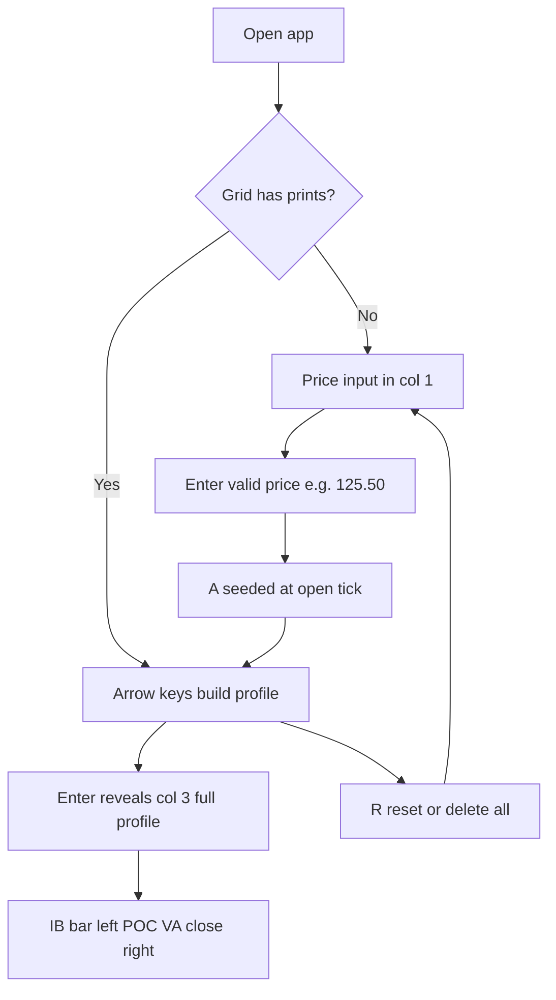
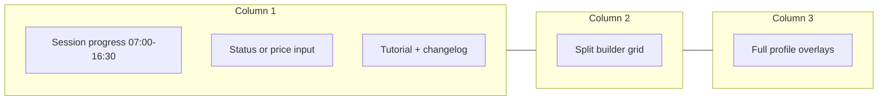

# Dogfood Report — Bund TPO Builder

**Date:** 2026-07-13  
**Branch:** `main` (post v1.1.0)  
**Scope:** v1.0.0 → HEAD (layout, IB bar, changelog, custom open price)  
**Live URL:** https://af-b1.github.io/bund-tpo-builder/  
**Personas:** A1 Instructor (primary), A2 Student (passive observer)

---

## Verdict

**Ready to teach with minor paper cuts** — core journeys work on live Pages; one small bug fixed during this pass (duplicate price-input listeners after reset). No escalations blocking use.

---

## Flows (diff-affected)





---

## Test matrix

| ID | Flow | Persona | Functional | Paper cuts |
|----|------|---------|------------|------------|
| F1 | Load live app | Instructor | **Pass** — loads, sidebar + empty grid | Must discover Enter on price box before arrows work |
| F2 | Set open price 126.25 | Instructor | **Pass** — ladder recentres, A prints | `alert()` on bad input feels abrupt for teaching |
| F3 | Build A+B, reveal profile | Instructor | **Pass** — col 3 appears, live sync | — |
| F4 | IB orange bar A+B range | Instructor | **Pass** — left of letters, thin bar | No “IB” label for students |
| F5 | POC / VA / close | Instructor | **Pass** — POC white on magenta, close points inward | — |
| F6 | Reset (R) | Instructor | **Pass** — back to price input, keeps last price | Tutorial still says Enter = full profile while in input mode |
| F7 | Delete all prints | Instructor | **Pass** — reverts to price input | — |
| F8 | Changelog link | Instructor | **Pass** — changelog.html 200, v1.1.0 listed | — |
| F9 | Observe side-by-side | Student | **Pass** — readable 3-column layout | Progress bar small on narrow sidebar |
| F10 | Unit tests | — | **Pass** — 12/12 | — |

---

## Fixes applied (this pass)

| Issue | Severity | Action |
|-------|----------|--------|
| Price input `keydown` listener stacked on every reset/re-render | Small bug | Guard with `data-bound` on input — commit with this report |

---

## Paper cuts (not fixed — low risk)

1. **Tutorial copy** — “Enter = full profile” shown while price input is active (Enter actually sets open). *Suggestion:* conditional hint: “Enter to set open” vs “Enter for full profile”.
2. **Validation UX** — `alert()` for bad price. *Suggestion:* inline red hint under input.
3. **IB teaching label** — orange bar has tooltip only. *Suggestion:* optional “IB” micro-label for projector sessions.
4. **R3 doc drift** — plan still says fixed 125.50; product now allows custom open (intentional v1.1).

---

## Escalations

None. No architecture or product decisions required before next teach.

---

## Automated checks

```text
npm test — 12 passed (3 files)
Live index — 200
Live session-status.js — v1.1.0 + start-price-input present
Live changelog.html — 200
```

**Note:** Full browser automation (`agent-browser`) not available in this environment; matrix validated via live asset fetch, code review, and unit tests.

---

## Learnings

- GitHub Pages serves JS modules — feature flags in rendered sidebar won’t appear in initial HTML fetch.
- Overlay lanes (left IB / right close) beat negative CSS positioning for col 3.
- Empty-grid ↔ price-input mode needs listener hygiene on re-render.

---

## Recommended next steps

1. **Teach one real session** on live link — note any confusion at open-price step.
2. **`/ce-compound`** — capture Pages + changelog + dogfood learnings.
3. **Optional v1.1.1** — conditional tutorial copy (paper cut #1 only).