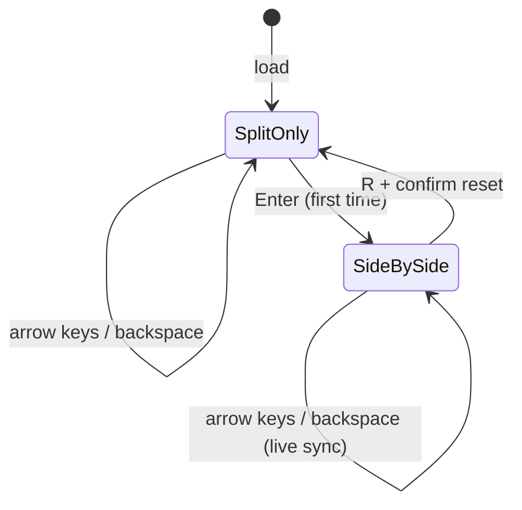

# Bund TPO Builder - Plan

## Goal Capsule

**Objective:** Deliver a local browser-based Bund futures TPO teaching tool with keyboard-driven Split View construction and a live-syncing Full Profile View that renders IBR, POC, 68.8% Value Area, and Close overlays.

**Product authority:** Teacher-led sessions — the instructor builds and explains; the tool provides clear visuals with minimal chrome. No tutorials or in-app teaching copy.

**Open blockers:** None.

## Product Contract

**Preservation note:** Product Contract unchanged from `ce-brainstorm` sharpening pass.

### Summary

A local HTML/JS app (open in browser, no server) lets an instructor keyboard-build a Bund futures market profile period-by-period in Split View (left), then press Enter to reveal a side-by-side Full Profile (right) with Initial Balance, POC, Value Area (68.8%), and Close markers that live-syncs as building continues.

### Problem Frame

Market Profile / TPO literacy requires seeing how letters accumulate into structure over time. Professional platforms like Sierra Chart provide this but are costly, complex, and hard to use in a teaching context. The instructor needs a minimal tool that mirrors the keyboard-driven build flow of live profile construction and then shows the finished profile the way students will eventually read it on a terminal — without tutorials, data feeds, or analysis tooling getting in the way during the build phase.

### Key Decisions

- **KD1. Local file, not hosted web app.** v1 is a self-contained HTML/JS file opened directly in the browser. Simplest path to "works well" with zero deployment.
- **KD2. Side-by-side layout after first Enter.** Split View / Build View on the left; Full Profile View on the right. Full Profile panel is hidden until the instructor presses Enter for the first time.
- **KD3. Build view has zero overlays.** VA, IBR, POC, and Close markers appear only in Full Profile View. Keeps construction visually clean.
- **KD4. Bund futures only in v1.** Single instrument preset: start price 125.50, tick increment 0.01 (125.50 → 125.51 → 125.52).
- **KD5. Value Area uses 68.8%.** Not the more common 70% default — instructor specified 68.8% normal-distribution coverage for VA highlighting.
- **KD6. Instructor provides narrative.** Tool stays minimal; no embedded tutorials, glossaries, or explanatory panels beyond what the visuals themselves convey.
- **KD7. Fixed session clock for v1.** Periods use 30-minute brackets starting at 07:00 (A = 07:00–07:30, B = 07:30–08:00, …). Column headers show letter and time range.
- **KD8. Live sync after reveal.** Once Full Profile is shown, it updates automatically as the instructor continues building in Split View.
- **KD9. Confirmed reset.** R triggers a confirmation dialog before clearing the session.

### Actors

- **A1. Instructor (primary)** — builds the profile via keyboard, triggers Full Profile render, teaches from either view.
- **A2. Student (passive)** — observes the instructor's screen during a session. No student interaction in v1.

### Requirements

**Platform and delivery**

- R1. The app runs as a local HTML/JS file opened in a modern desktop browser with no backend server required.
- R2. All session state (grid data, cursor position, rendered overlays) lives in browser memory for the session; persistence across browser restarts is not required in v1.

**Instrument**

- R3. v1 simulates Bund futures with a price ladder starting at 125.50.
- R4. Each tick step increments or decrements price by 0.01 (e.g., 125.50, 125.51, 125.52).
- R5. Higher prices appear above lower prices on the vertical axis, matching standard market-profile convention.

**Split View / Build View**

- R6. Split View displays time periods as columns labeled A through S initially, with architecture that allows adding more periods later without redesign. Each column header shows the letter and its 30-minute time range starting at 07:00 (e.g., A = 07:00–07:30, B = 07:30–08:00).
- R7. A price label column appears on the left of the letter grid, showing the Bund tick ladder.
- R8. On first load, the cursor and first A print appear at 125.50.
- R9. Arrow Up moves the cursor one tick higher and prints the current period's letter at that price row.
- R10. Arrow Down moves the cursor one tick lower and prints the current period's letter at that price row.
- R11. Arrow Right advances to the next period (A → B → C → …) and prints that period's letter at the current cursor price.
- R12. Arrow Left moves back to the previous period without erasing existing prints.
- R13. When the cursor moves beyond the visible price rows, the ladder auto-scrolls to keep the cursor in view, with 125.50 near center at session start until price movement warrants shifting.
- R14. Split View uses a light gray background with monospace black letters, matching the instructor's reference style; early-period letters A and B may use magenta/pink coloring consistent with the reference screenshot.
- R15. Split View displays no analysis overlays — no Initial Balance bar, no POC line, no Value Area highlight, no Close marker. Backspace or Delete removes the letter at the current cursor cell.

**Full Profile View**

- R16. Pressing Enter transitions from build mode to Full Profile View using the data built in Split View.
- R17. Full Profile View renders a merged single-column profile shape (bell-shaped letter block), not split period columns — matching the instructor's `tpo full` reference.
- R18. Initial Balance displays as an orange vertical bar on the left spanning the full price range of all A and B prints in the session.
- R19. Point of Control displays as a pink horizontal line at the price row containing the highest TPO letter count.
- R20. Value Area displays as pink/magenta letter highlighting covering 68.8% of total TPO letters, expanded symmetrically from POC per standard market-profile VA algorithm.
- R21. Close displays as a small red triangle on the left at the price of the instructor's most recent TPO print in the session; it updates as building continues after Full Profile is revealed.
- R22. Letters outside the Value Area in Full Profile View remain black on gray, consistent with the reference.

**Layout and dual-view behavior**

- R23. Before the first Enter, only Split View is visible (Full Profile panel is hidden).
- R24. After the first Enter, the layout becomes side-by-side: Split View on the left, Full Profile on the right.
- R25. After Full Profile is revealed, edits in Split View live-sync to Full Profile automatically — overlays and merged shape recalculate without re-pressing Enter.
- R26. R triggers a confirmation dialog; on confirm, the session fully resets — grid cleared, overlays cleared, Full Profile panel hidden, cursor and first A print return to 125.50.

**Visual references**

- R27. Split View visual target: instructor reference `TPO.png` (gray canvas, period columns, monospace letters).
- R28. Full Profile visual target: instructor reference `tpo full.png` (merged profile, orange IBR, pink POC/VA, red close triangle).

### Key Flows

- F1. Session start
  - **Trigger:** Instructor opens the HTML file in a browser.
  - **Actors:** A1
  - **Steps:** App loads Split View only (Full Profile panel hidden); Bund ladder centered on 125.50; period A header shows 07:00–07:30; cursor and first A print appear at 125.50; chart area is focused for keyboard input.
  - **Outcome:** Instructor can immediately begin building.

- F2. Build profile
  - **Trigger:** Instructor uses arrow keys in Split View.
  - **Actors:** A1
  - **Steps:** Up/Down extend the current period letter across price levels; Right advances period; profile shape emerges column by column; ladder auto-scrolls as needed.
  - **Outcome:** A complete or partial session profile exists in the grid data.

- F3. Reveal Full Profile
  - **Trigger:** Instructor presses Enter for the first time.
  - **Actors:** A1
  - **Steps:** Full Profile panel appears on the right; app computes IBR (A+B range), POC (max count row), VA (68.8% from POC), and Close (last print price); renders merged Full Profile with all four overlays.
  - **Outcome:** Side-by-side teaching layout is active.

- F4. Live-sync teaching
  - **Trigger:** Instructor continues building in Split View after Full Profile is revealed.
  - **Actors:** A1, A2 (observing)
  - **Steps:** Split edits propagate to Full Profile in real time; overlays and Close marker recalculate; instructor references left panel for period-by-period construction and right panel for IBR/POC/VA/Close reading.
  - **Outcome:** Both construction and analysis stay current without re-pressing Enter.

- F5. Correct a mistake
  - **Trigger:** Instructor places a wrong letter.
  - **Actors:** A1
  - **Steps:** Instructor moves cursor to the cell and presses Backspace or Delete; letter is removed; Full Profile syncs if visible.
  - **Outcome:** Error corrected without full session reset.

- F6. Reset session
  - **Trigger:** Instructor presses R.
  - **Actors:** A1
  - **Steps:** Confirmation dialog appears; on confirm, grid and overlays clear, Full Profile panel hides, session returns to 125.50 / period A / 07:00–07:30.
  - **Outcome:** Fresh session for a new teaching example.

### Acceptance Examples

- AE1. First print at open
  - **Covers:** R8, R9
  - **Given:** Fresh session, Split View loaded
  - **When:** Instructor takes no action beyond load
  - **Then:** Price 125.50 shows letter A in period A column; cursor is at that cell.

- AE2. Extend A upward
  - **Covers:** R9, R4
  - **Given:** A printed at 125.50
  - **When:** Instructor presses Up twice
  - **Then:** Letters A appear at 125.51 and 125.52; cursor is at 125.52.

- AE3. Advance to B
  - **Covers:** R11
  - **Given:** Cursor at 125.52 in period A
  - **When:** Instructor presses Right
  - **Then:** Period B is active; letter B prints at 125.52; A prints at 125.50–125.52 remain unchanged.

- AE4. Full Profile overlays
  - **Covers:** R16–R22
  - **Given:** Profile built through period S with known A-range, B-range, dominant row, and last print at a specific price
  - **When:** Instructor presses Enter
  - **Then:** Full Profile shows merged shape; orange IBR spans A+B high/low; pink POC line at max-count row; pink VA covers 68.8% of letters; red triangle at last-print price.

- AE5. Side-by-side reveal
  - **Covers:** R23, R24
  - **Given:** Profile partially built, Full Profile not yet shown
  - **When:** Instructor presses Enter
  - **Then:** Full Profile panel appears on the right; Split View remains on the left with build intact.

- AE6. Live sync
  - **Covers:** R25, R21
  - **Given:** Full Profile visible
  - **When:** Instructor prints a new letter in Split View
  - **Then:** Full Profile merged shape and overlays update without Enter; Close triangle moves to the new last-print price.

- AE7. Backspace correction
  - **Covers:** R15
  - **Given:** Letter B at 125.55 in period B
  - **When:** Instructor moves cursor to that cell and presses Backspace
  - **Then:** Letter B is removed; Full Profile syncs if visible.

- AE8. Confirmed reset
  - **Covers:** R26
  - **Given:** Full Profile visible with data in grid
  - **When:** Instructor presses R and confirms
  - **Then:** Grid clears, Full Profile panel hides, session returns to 125.50 with A at 07:00–07:30.

### Success Criteria

- SC1. An instructor with no developer assistance can open the file and build a recognizable Bund TPO profile in under two minutes using only arrow keys.
- SC2. Full Profile View after Enter is visually recognizable against the instructor's `tpo full.png` reference without explanation.
- SC3. Zero network requests required after the file is on disk.

### Scope Boundaries

**Deferred for later**

- Data import from Sierra Chart, CSV, or market data APIs
- Replay mode stepping through historical sessions
- Student hands-on build or quiz mode
- Multi-instrument support beyond Bund
- Session save/load to disk
- Volume profile overlay
- Configurable VA percentage, session start time, period length, or tick size UI

**Outside this product's identity (v1)**

- Tutorial content, glossaries, or guided lessons inside the app
- Live market data feeds or brokerage connectivity
- Replacing Sierra Chart as a trading terminal

### Dependencies / Assumptions

- **Assumption:** Instructor teaches from a desktop/laptop with a physical keyboard; touch-only input is not a v1 target.
- **Assumption:** Students view the instructor's screen; no multi-user or remote collaboration in v1.
- **Reference:** Sierra Chart TPO documentation defines standard POC/VA calculation approach; VA percentage overridden to 68.8% per instructor preference.
- **Reference:** Instructor visual references stored at `Pictures/Screenshots/TPO.png` (Split style) and `Pictures/Screenshots/tpo full.png` (Full Profile style).

### Outstanding Questions

None.

---

## Planning Contract

### Summary

Greenfield vanilla HTML/CSS/JS app with no build step required for delivery. Pure profile-analytics functions are unit-tested; browser interaction is verified via manual smoke checklist. Single-page architecture with ES modules keeps v1 simple and double-clickable.

### Key Technical Decisions

- **KTD1. ES modules, no bundler for v1.** `index.html` loads `src/main.js` as a module. Keeps the "open file in browser" delivery model simple. A dev server is optional for local testing only.
- **KTD2. Separate pure analytics from DOM rendering.** `src/profile/analytics.js` holds merge, POC, VA (68.8%), IBR, and close calculations with no DOM dependencies — fully unit-testable.
- **KTD3. Grid keyed by tick index, not float price.** Store prints as `grid[tickIndex][periodIndex] = letter` where `tickIndex` maps to price via `basePrice + tickIndex * tickSize`. Avoids floating-point comparison bugs.
- **KTD4. Single reactive render pass.** Any state mutation calls `render()` which redraws Split and Full views from the same session state. Live sync (R25) is automatic because both panels read one state object.
- **KTD5. Vitest for unit tests.** Test analytics and period-label generation only; no Playwright in v1.
- **KTD6. VA algorithm matches Sierra Chart symmetric expansion.** Start at POC row, alternate adding adjacent rows (prefer side with higher TPO count on tie) until cumulative TPO count reaches `ceil(total * 0.688)`.

### High-Level Technical Design



**Data flow:** keyboard event → mutate `SessionState` → `computeAnalytics(state)` → render Split panel + render Full panel (if revealed).

**SessionState shape (conceptual):**

- `grid`: sparse 2D letter store by tick index and period index
- `cursor`: `{ periodIndex, tickIndex }`
- `lastPrint`: `{ periodIndex, tickIndex }` updated on every print action
- `fullProfileRevealed`: boolean
- `config`: Bund constants (start price 125.50, tick 0.01, session start 07:00, period minutes 30, period count 19)

### Assumptions

- Modern Chromium-based or Firefox browser with ES module support.
- Instructor opens via `file://` or a simple static server; both must work.
- Period letters beyond S are not required in v1 but period config array is extensible.

---

## Output Structure

```text
tpo-builder/
  index.html
  package.json
  src/
    main.js
    config.js
    state.js
    keyboard.js
    profile/
      analytics.js
      periods.js
    render/
      split-view.js
      full-profile.js
      layout.js
    styles/
      app.css
  tests/
    analytics.test.js
    periods.test.js
  docs/
    plans/
      2026-07-13-001-feat-bund-tpo-builder-plan.md
```

---

## Implementation Units

### U1. Session config, state model, and period labels

**Goal:** Establish Bund constants, session state shape, and 07:00-based period header labels.

**Requirements:** R3, R4, R6, R8

**Dependencies:** None

**Files:**
- `src/config.js`
- `src/state.js`
- `src/profile/periods.js`
- `tests/periods.test.js`

**Approach:** `config.js` exports `START_PRICE`, `TICK_SIZE`, `SESSION_START`, `PERIOD_MINUTES`, `INITIAL_PERIOD_COUNT` (19 = A–S). `periods.js` generates period metadata: letter, start time, end time formatted as `HH:MM–HH:MM`. `state.js` exports `createInitialState()` returning empty grid, cursor at period 0 / open tick index, `fullProfileRevealed: false`, and seeds first A print at 125.50.

**Execution note:** Implement period-label tests first.

**Test scenarios:**
- Period A label is `07:00–07:30` and letter `A`.
- Period B label is `07:30–08:00`.
- Period S is the 19th period with correct end time.
- `createInitialState()` places cursor and A print at 125.50 tick index.
- `priceAtTickIndex(0)` returns `125.50`; increment by 0.01 per index.

**Verification:** Vitest passes; tick-to-price mapping is invertible for test range.

---

### U2. Profile analytics (merge, IBR, POC, VA, close)

**Goal:** Pure functions that compute all Full Profile overlays from grid state.

**Requirements:** R17–R22, R20, R21

**Dependencies:** U1

**Files:**
- `src/profile/analytics.js`
- `tests/analytics.test.js`

**Approach:**
- `mergeProfile(grid)` → per tick index, concatenate letters from periods A→S that have prints (order preserved).
- `countTposPerRow(grid)` → TPO count per tick index from merged letters (each letter char = 1 TPO).
- `computePOC(counts)` → tick index with max count; ties pick lower price (lower tick index).
- `computeValueArea(counts, pocIndex, pct=0.688)` → symmetric expansion from POC per KTD6.
- `computeIBR(grid)` → min/max tick index among all A and B period prints.
- `computeClose(lastPrint)` → price at last print tick index.

**Test scenarios:**
- Covers AE4. Known small grid produces expected POC row.
- VA at 68.8% on 10 TPOs includes `ceil(10 * 0.688) = 7` TPOs.
- IBR spans only A and B prints, ignoring C onward.
- Merge concatenates `A` then `B` letters at same price in period order.
- Empty grid returns null overlays without throwing.
- Tie at POC picks lower price row.

**Verification:** All analytics tests pass with hand-constructed grids matching acceptance examples.

---

### U3. Split View renderer and keyboard controller

**Goal:** Render period-column grid with price ladder and handle arrow/backspace input.

**Requirements:** R6–R15, R9–R12

**Dependencies:** U1

**Files:**
- `src/render/split-view.js`
- `src/keyboard.js`
- `src/styles/app.css` (split section)

**Approach:** `split-view.js` renders header row (period labels with times), price column, and letter cells. Active cursor cell gets outline. A/B letters use magenta class. `keyboard.js` listens on focused chart wrapper: Up/Down adjust tick index and print; Right/Left change period; Backspace clears cell; ignore key repeat stacking issues via action-on-keydown. Each mutation updates `lastPrint` when a print occurs.

**Test scenarios:**
- Covers AE1, AE2, AE3, AE7.
- Arrow Right at period boundary does not exceed period S in v1.
- Backspace on empty cell is no-op.
- Left arrow changes period without deleting letters.

**Verification:** Manual smoke — build AE2 and AE3 scenario in browser; automated tests cover state transitions via exported handler functions where practical.

---

### U4. Price ladder auto-scroll

**Goal:** Keep cursor row visible as price moves away from initial window.

**Requirements:** R5, R13

**Dependencies:** U3

**Files:**
- `src/render/split-view.js` (scroll logic)

**Approach:** Maintain `visibleTickStart` in state or derive from cursor so open price (125.50) starts near vertical center. When cursor approaches top/bottom edge (within 3 rows), shift visible window. Re-render price labels for visible slice only.

**Test scenarios:**
- Cursor at 125.50 on load is vertically centered in visible ladder.
- After 10 consecutive Up presses, visible window shifts so cursor remains in view.
- Price order remains ascending upward.

**Verification:** Manual smoke scrolling far from open; no cursor moves off-screen.

---

### U5. Full Profile renderer and overlays

**Goal:** Render merged profile column with orange IBR, pink POC, 68.8% VA highlight, and red close triangle.

**Requirements:** R16–R22, R27, R28

**Dependencies:** U2

**Files:**
- `src/render/full-profile.js`
- `src/styles/app.css` (full profile section)

**Approach:** `full-profile.js` consumes analytics output. Merged letters in one column per price row. Orange vertical bar positioned at IBR high/low. Pink horizontal rule at POC row. VA rows get magenta letter class. Red CSS triangle at close row on left edge. No overlays render when grid empty.

**Test scenarios:**
- Covers AE4.
- Letters outside VA remain black.
- IBR bar height equals A+B price range only.
- Close triangle position updates when `lastPrint` changes.

**Verification:** Visual compare against `tpo full.png` reference; analytics tests cover numeric correctness.

---

### U6. Layout shell, Enter reveal, live sync, reset

**Goal:** Wire dual-panel layout, first Enter reveal, continuous sync, and confirmed reset.

**Requirements:** R16, R23–R26, R25, F3, F4, F6

**Dependencies:** U3, U5

**Files:**
- `src/render/layout.js`
- `src/main.js`
- `index.html`

**Approach:** `layout.js` manages panel visibility — Full Profile container `display:none` until `fullProfileRevealed`. Enter key sets flag true and applies side-by-side CSS grid. `main.js` orchestrates: init state → render loop on every mutation. R key opens `confirm()` dialog; on OK calls `createInitialState()`. Enter after reveal is no-op (already side-by-side).

**Test scenarios:**
- Covers AE5, AE6, AE8.
- Full panel hidden on load.
- Enter shows right panel without clearing grid.
- Print after reveal updates full panel without second Enter.
- Reset cancel leaves state unchanged.
- Reset confirm hides right panel.

**Verification:** Manual smoke through F1→F6 flows; SC1 timing check informal.

---

### U7. Visual polish and delivery README

**Goal:** Match reference styling and document how to open the app.

**Requirements:** R14, R22, R27, R28, SC3

**Dependencies:** U6

**Files:**
- `src/styles/app.css`
- `README.md`

**Approach:** Gray backgrounds (`#b8b8b8`), monospace letters, compact column widths (~18px), minimal chrome, no tutorial copy. README explains double-click `index.html` or `npx serve .` for local use.

**Test expectation:** none — styling and README only.

**Verification:** Side-by-side visual comparison with `TPO.png` and `tpo full.png`; README instructions work on Windows.

---

## Verification Contract

**Unit tests**

```bash
npm test
```

Runs Vitest against `tests/analytics.test.js` and `tests/periods.test.js`.

**Manual smoke checklist**

1. Open `index.html` in browser — only Split View visible, A at 125.50.
2. Up/Down/Right builds profile; period headers show times.
3. Enter reveals Full Profile right panel with overlays.
4. Continue building — Full Profile live-syncs.
5. Backspace removes a letter; Full Profile updates.
6. R → cancel → no change; R → confirm → fresh session, Full panel hidden.

**Quality gates**

- All unit tests pass.
- No console errors during smoke checklist.
- No network requests when opened as `file://`.

---

## Definition of Done

**Global**

- All implementation units U1–U7 complete.
- Requirements R1–R28 traced to at least one unit or verification step.
- Acceptance examples AE1–AE8 pass via unit tests and/or manual smoke.
- Success criteria SC1–SC3 met.
- Product Contract preservation note intact — no scope drift from brainstorm.

**Per unit**

| Unit | Done when |
|------|-----------|
| U1 | Period labels and initial state tests pass |
| U2 | Analytics tests pass including 68.8% VA and IBR |
| U3 | Keyboard build flow works per AE1–AE3, AE7 |
| U4 | Auto-scroll keeps cursor visible |
| U5 | Full Profile overlays match reference shape |
| U6 | Enter reveal, live sync, reset confirmed |
| U7 | Visual polish and README complete |

---

## Scope Boundaries (Planning)

### Deferred to Follow-Up Work

- Extract shared color tokens to a theme config file.
- Add Playwright keyboard smoke tests.
- Package as optional PWA for offline install.