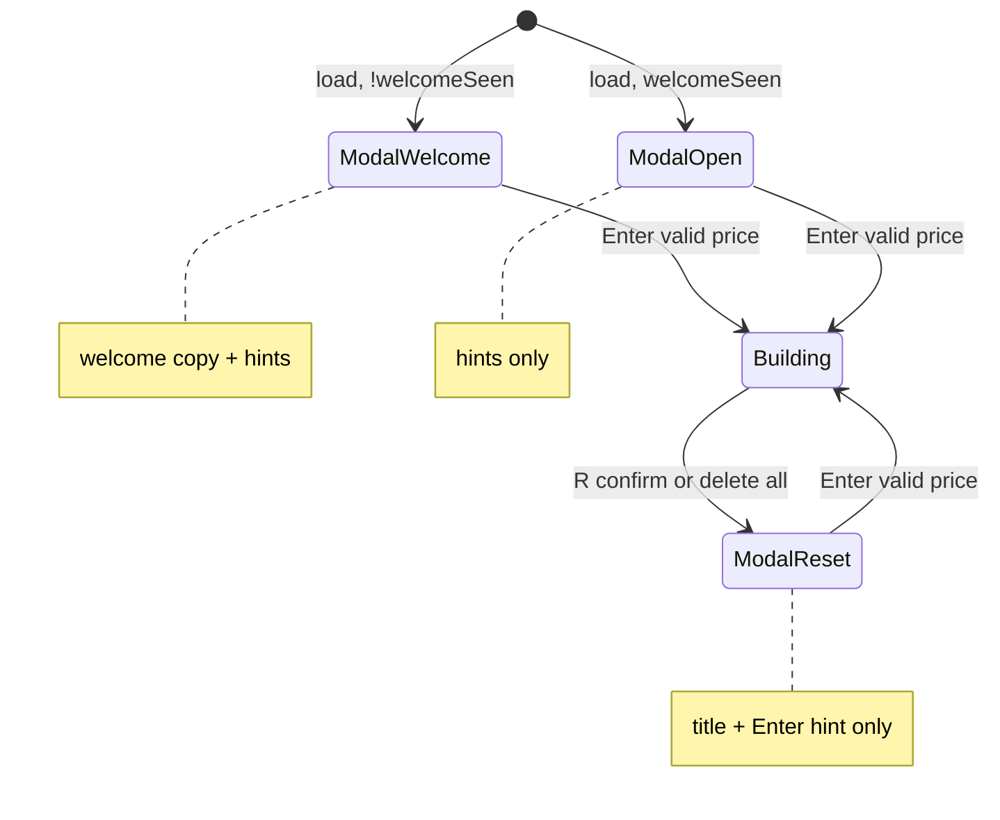

# Bund TPO Builder — Onboarding modal (v1.2)

## Goal Capsule

**Objective:** Replace the sidebar open-price + tutorial block with a centered onboarding modal on load and after reset, so instructors get a clear entry point before the grid accepts keyboard input. First visit adds a welcome message; reset shows a minimal open-price prompt only.

**Product authority:** Teacher-led sessions — the instructor still builds manually; the modal frames *why* and *how to start*, then gets out of the way. Sidebar remains for live session status and build shortcuts once printing begins.

**Builds on:** v1.1.2 (`hasPrints` gate, `applyStartPrice`, listener `data-bound` guard — see `docs/solutions/ui-bugs/profile-overlay-lanes-and-sidebar-input.md`).

**Open blockers:** None.

## Product Contract

**Preservation note:** Extends v1 sidebar teaching copy (already shipped in v1.1.x) into a modal onboarding layer. Original brainstorm KD6 (“no tutorials”) is superseded in practice by v1.1 sidebar hints; v1.2 relocates and sharpens that copy without adding post-start tutorials or glossaries.

### Summary

On every fresh page load (hard reload) and whenever the session has no prints (reset or delete-all), a modal dialog blocks the workspace until the instructor enters a valid open price and presses Enter. The first visit ever in that browser shows a short welcome paragraph; later loads and `R` resets show only the open-price prompt. After Enter, behavior matches v1.1.2: ladder recenters, period A prints at the open tick, arrow keys work, sidebar shows live status and build shortcuts.

### Problem Frame

v1.1.2 puts the open-price input and tutorial hints in the bottom-left sidebar. Instructors must discover that column before building — easy to miss on a projector or first open. A modal makes “start here” unavoidable on load and after reset, while keeping the three-column layout unchanged once the session begins.

### Key Decisions

- **KD1. Modal is the sole open-price surface.** When `!hasPrints(state)`, the sidebar does not render a price input or open-price tutorial lines. All open-price UX lives in the modal.
- **KD2. Modal visibility derives from print state.** `!hasPrints(state)` ⇒ modal open. No separate “modal dismissed without prints” path — invalid Enter keeps the modal open.
- **KD3. Welcome is once per browser profile.** `localStorage` flag `bund-tpo-builder.welcomeSeen` gates the welcome block. Hard reload on a returning profile shows open-price + keyboard hints without welcome. Clearing site data shows welcome again.
- **KD4. Reset modal is minimal.** After `R` confirm (or delete-all prints), modal shows title + price input + Enter hint only — no welcome, no arrow-key guide, no changelog link.
- **KD5. First-load modal includes relocated sidebar copy.** First visit (welcome) and subsequent hard reloads (no welcome) both include the current open-price keyboard hints (`Enter` set open, decimal example) that today live in `guideBlock` when `!hasPrints`.
- **KD6. Inline validation in modal.** Replace `alert()` for bad prices with an inline error under the input (dogfood paper cut; same submit path).
- **KD7. Version v1.2.0.** Tag milestone after share bundle rebuild and changelog update.

### Actors

- **A1. Instructor (primary)** — reads welcome (first time), enters open price, builds as today.
- **A2. Student (passive)** — sees modal briefly at session start; unchanged after build begins.

### Requirements

**Onboarding modal**

- R1. On initial page load with empty grid, a modal overlay is visible and focused; the builder grid is visible but dimmed behind it.
- R2. Modal contains a price text input prefilled with `state.startPrice` (default `125.50`, or last price after reset).
- R3. Pressing Enter in the input validates via `parseStartPrice` / `applyStartPrice`; on success the modal closes, first `A` prints, and keyboard build input is enabled.
- R4. On validation failure, modal stays open and shows an inline error message (no `alert()`).
- R5. First visit in browser (`!localStorage.welcomeSeen`): modal shows welcome heading + teaching paragraph (copy below) above the open-price section.
- R6. Subsequent page loads with empty grid: modal shows open-price title + input + relocated keyboard hints; no welcome paragraph.
- R7. After `R` reset confirm or delete-all prints: modal shows minimal copy — title “Set open price” (or equivalent), input, and “Press Enter to start period A”; no welcome, no full keyboard guide, no changelog.
- R8. While modal is open, global arrow/Enter/R handlers do not mutate the grid (already gated by `!hasPrints`; ensure input Enter does not bubble to reveal full profile).
- R9. Modal uses `role="dialog"`, `aria-modal="true"`, labelled title, and focus on the price input when opened.

**Sidebar (column 1) after change**

- R10. Session progress bar (07:00–16:30) always renders.
- R11. When `!hasPrints(state)`, sidebar shows no price input and no open-price tutorial lines (modal owns that).
- R12. When `hasPrints(state)`, sidebar shows live print status and build keyboard guide unchanged from v1.1.2.
- R13. Changelog link remains in sidebar guide block when session has started; omit from modal.

**Regression**

- R14. Custom open price, live sync, full profile reveal, IB/POC/VA/close overlays, and confirmed reset behave as v1.1.2 after modal closes.
- R15. `data-bound` guard on price input listener survives re-render when modal reopens (reset / delete-all).

### Proposed copy

**Welcome (first visit only)**

- **Title:** Welcome to Bund TPO Builder
- **Body:** This teaching tool helps you see how a session develops as you build it letter by letter. Entering each print yourself gives you a kinesthetic feel for how the day unfolds — sharper questions and better expectations follow.

**Open price — first load / hard reload (returning user)**

- **Title:** Set session open price
- **Hints:** `Enter` set open price · Type a decimal price (e.g. `125.50`), then press Enter to start period A.

**Open price — after R or delete-all**

- **Title:** Set open price
- **Hint:** Press Enter to start period A at this price.

*(Implementer may tighten wording for modal width; meaning must match.)*

### Key Flows

- F1. First visit
  - **Trigger:** Open live URL or local app; `welcomeSeen` unset; empty grid.
  - **Steps:** Modal with welcome + input → Enter valid price → modal closes → A at open → sidebar shows build guide.
  - **Outcome:** Instructor oriented and building.

- F2. Hard reload (returning browser)
  - **Trigger:** Hard reload; `welcomeSeen` set; empty grid.
  - **Steps:** Modal with open-price title + hints (no welcome) → Enter → build.
  - **Outcome:** Same as v1.1.2 without sidebar price input.

- F3. Reset session
  - **Trigger:** `R` → confirm.
  - **Steps:** Grid cleared, full profile hidden, last `startPrice` kept → minimal modal → Enter → A seeded → build.
  - **Outcome:** New example without re-reading welcome.

- F4. Delete all prints
  - **Trigger:** Delete/Backspace removes last letter.
  - **Steps:** Same minimal modal as F3.
  - **Outcome:** Return to open-price entry without full reset.

### Acceptance Examples

- AE1. First visit welcome
  - **Given:** Fresh browser profile, app loaded
  - **When:** Page renders
  - **Then:** Modal visible with “Welcome to Bund TPO Builder” and price input; sidebar has no `start-price-input`.

- AE2. Enter starts session
  - **Given:** Modal open, input `126.25`
  - **When:** Enter pressed
  - **Then:** Modal hidden; A at 126.25; arrow Up prints A at 126.26.

- AE3. Invalid price inline error
  - **Given:** Modal open
  - **When:** Enter with `126` (no decimal)
  - **Then:** Inline error shown; modal still open; no alert dialog.

- AE4. Hard reload without welcome
  - **Given:** `welcomeSeen` true, empty grid after reload
  - **When:** Page renders
  - **Then:** Modal without welcome paragraph; includes decimal hint.

- AE5. Reset minimal modal
  - **Given:** Active session with prints
  - **When:** `R` confirmed
  - **Then:** Minimal modal (no welcome, no arrow-key list); input prefilled with last open price.

- AE6. Sidebar build guide after start
  - **Given:** Open price accepted
  - **When:** Sidebar renders
  - **Then:** Shows “show full profile”, arrow hints; no price input.

### Success Criteria

- SC1. A new instructor cannot miss the open-price step on first open (modal is unavoidable).
- SC2. Reset-to-new-example takes ≤2 actions (R confirm + Enter) before building again.
- SC3. No regression in analytics, layout, or 14 existing unit tests (updated where sidebar contract changes).

### Scope Boundaries

**In scope (v1.2)**

- Modal component, styles, wiring, copy variants
- Sidebar slimming when empty grid
- Inline validation
- Tests for modal modes + updated session-status tests
- Changelog v1.2.0, version strings, `share/` rebuild

**Deferred**

- “Don’t show welcome again” button (localStorage already handles)
- IB micro-label (prior v1.1 polish lane)
- Session save/load, export, configurable VA% (V2)
- Playwright browser tests
- Animations beyond simple fade (optional CSS transition only)

**Outside identity**

- Post-start tutorial tours or step-by-step wizards
- Student quiz mode

### Outstanding Questions

None blocking. Copy can be tuned during implementation without plan revision.

---

## Planning Contract

### Summary

Add a small render module for the onboarding modal, a `welcomeSeen` helper in `src/onboarding.js` (or `src/storage.js`), and derive modal mode from `{ hasPrints, welcomeSeen, trigger }` where `trigger` is `load | reset` (reset and delete-all share minimal copy). Reuse `applyStartPrice` and `parseStartPrice` unchanged. Move `bindStartPriceInput` from sidebar query to modal root. Update `renderSessionStatus` to drop empty-grid input and open-price `guideBlock` lines.

### Key Technical Decisions

- **KTD1. Modal mount point in `index.html`.** Add `<div id="onboarding-modal" hidden></div>` as sibling inside `#app-shell` or directly under `body`, rendered by `src/render/onboarding-modal.js`. Keeps split/full renderers untouched.
- **KTD2. Modal mode enum.** `welcome` | `open` | `reset` — computed in `main.js`:
  - `welcome`: `!hasPrints && !welcomeSeen()`
  - `open`: `!hasPrints && welcomeSeen()` on initial load only (set `lastOpenTrigger = 'load'` in init)
  - `reset`: `!hasPrints && lastOpenTrigger === 'reset'` (set in `keyboard.js` on R confirm and when delete-all detected)
- **KTD3. `welcomeSeen` set on first successful `applyStartPrice`.** Not on modal display — instructor must complete one session start before welcome is suppressed on future loads.
- **KTD4. Keyboard isolation.** `handleKeyDown` early-return when `event.target` is input (existing). Modal input uses same `keydown` Enter handler pattern with `data-bound` guard per solutions doc.
- **KTD5. Render order.** `render()` → layout → split → session-status → if `!hasPrints` render modal + bind input; else hide modal container. Do not call `renderFullProfile` until prints exist (unchanged).
- **KTD6. Test without jsdom.** Modal render tests use `{ innerHTML }` stub container pattern from `docs/solutions/best-practices/render-function-regression-without-dom.md`.

### High-Level Design



**Files touched**

| Area | Files |
|------|-------|
| Shell | `index.html` |
| Orchestration | `src/main.js`, `src/keyboard.js` |
| New | `src/onboarding.js`, `src/render/onboarding-modal.js` |
| Sidebar | `src/render/session-status.js` |
| Styles | `src/styles/app.css` |
| Tests | `tests/onboarding-modal.test.js`, `tests/session-status.test.js` |
| Ship | `CHANGELOG.md`, `changelog.html`, `share/*`, `src/render/session-status.js` (version string) |

### Assumptions

- Instructors use desktop browsers with `localStorage` (GitHub Pages + zip local server).
- Hard reload clears in-memory state but not `localStorage`.
- Projector readability: modal max-width ~420px, 13–14px body text, existing kbd styling.

---

## Implementation Units

### U1. Welcome persistence helper

**Goal:** Read/write `welcomeSeen` in localStorage safely.

**Requirements:** R5, R6

**Files:** `src/onboarding.js`, `tests/onboarding.test.js`

**Approach:** Export `isWelcomeSeen()`, `markWelcomeSeen()`. Try/catch around localStorage for private-mode failures — treat as “not seen” if unavailable.

**Test scenarios:**

- Default `isWelcomeSeen()` false when key absent.
- After `markWelcomeSeen()`, `isWelcomeSeen()` true.
- Invalid stored value treated as false.

**Verification:** Vitest passes.

---

### U2. Onboarding modal renderer

**Goal:** Render three modal variants with shared input + inline error slot.

**Requirements:** R1–R4, R5–R7, R9

**Files:** `src/render/onboarding-modal.js`, `src/styles/app.css`, `tests/onboarding-modal.test.js`

**Approach:**

- `renderOnboardingModal(container, { mode, startPrice, error })` sets `hidden` false and innerHTML.
- Modes:
  - `welcome` — welcome title + body + open-price field + full hints + optional changelog omitted
  - `open` — “Set session open price” + hints (relocated from sidebar `guideBlock`)
  - `reset` — minimal title + input + single Enter line
- Shared input: `class="start-price-input"`, `aria-label`, `inputmode="decimal"`.
- Error paragraph: `class="onboarding-error"` when `error` string set.
- CSS: `.onboarding-backdrop` fixed full viewport, semi-transparent; `.onboarding-dialog` centered card on gray `#d0d0d0` to match app chrome; re-use `.start-price-input` rules.

**Test scenarios:**

- `welcome` HTML contains “Welcome to Bund TPO Builder” and `start-price-input`.
- `open` HTML contains decimal hint, no welcome heading.
- `reset` HTML contains “Set open price”, no `<kbd>↑</kbd>`, no welcome.
- Error string renders `.onboarding-error`.

**Verification:** Vitest render stubs; visual smoke on live layout.

---

### U3. Wire modal open/close in main and keyboard

**Goal:** Show correct modal on load, reset, delete-all; close on successful Enter.

**Requirements:** R2, R3, R8, R14, R15, F1–F4

**Files:** `index.html`, `src/main.js`, `src/keyboard.js`

**Approach:**

- Add modal container to `index.html`.
- `main.js`:
  - Track `openPriceTrigger: 'load' | 'reset'` module variable.
  - `computeModalMode(state)` using U1 + trigger.
  - Move `bindStartPriceInput` to query modal container; on Enter success call `markWelcomeSeen()`, set `openPriceTrigger = 'load'`, `render()`.
  - On `!hasPrints`, call `renderOnboardingModal`; else set modal `hidden` and clear innerHTML.
  - Replace `alert(result.error)` with re-render modal passing `error: result.error`.
- `keyboard.js`:
  - On `R` confirm: set `openPriceTrigger = 'reset'` before `onChange()` (export setter from `main.js` or small shared `src/onboarding.js` flag).
  - On delete-all branch (`!hasPrints` after delete): set trigger `reset`.

**Test scenarios:**

- Covers AE2, AE5 (manual smoke + existing state tests still pass).
- Listener not duplicated after double reset (inspect `data-bound` or behavior test).

**Verification:** Manual F1–F4 smoke; `npm test`.

---

### U4. Slim sidebar when empty grid

**Goal:** Remove sidebar price input and open-price tutorial; keep progress + post-start guide.

**Requirements:** R10–R13, AE1, AE6

**Files:** `src/render/session-status.js`, `tests/session-status.test.js`

**Approach:**

- When `!hasPrints`: render progress + static placeholder or omit `statusBlock` / `guideBlock` open-price branches entirely (progress-only sidebar is acceptable).
- When `hasPrints`: unchanged `statusBlock` + build `guideBlock`.
- Bump changelog link to v1.2.0 in guide footer.

**Test scenarios:**

- Empty grid HTML: no `start-price-input`, no “set open price”.
- After `applyStartPrice`: build shortcuts present, no price input.

**Verification:** Updated `session-status.test.js` assertions.

---

### U5. Ship v1.2.0

**Goal:** Document release and refresh standalone bundle.

**Requirements:** KD7

**Files:** `CHANGELOG.md`, `changelog.html`, `share/changelog.html`, `share/Bund-TPO-Builder.html`, `Agents.md` (release line)

**Approach:**

- Add `## [1.2.0]` section: onboarding modal, inline validation, sidebar slimming.
- Run `powershell -ExecutionPolicy Bypass -File tools\make-standalone.ps1`.
- Copy output to `share/Bund-TPO-Builder.html` if script does not already.

**Verification:** Zip smoke — `share/START HERE.bat` shows modal on load.

---

## Verification Contract

**Unit tests**

```bash
npm.cmd test
```

Expected: all prior tests updated green + new `onboarding.test.js`, `onboarding-modal.test.js`.

**Manual smoke checklist**

1. Clear site data → load → welcome modal → Enter `125.50` → build works.
2. Hard reload → modal without welcome → Enter → build.
3. Build partial profile → Enter reveal → live sync OK.
4. `R` confirm → minimal modal → Enter → A at last open price.
5. Delete all letters → minimal modal returns.
6. Invalid `125` → inline error, no alert.
7. Sidebar during build still shows shortcuts; empty grid sidebar has no price box.

**Quality gates**

- No `alert()` for price validation.
- No duplicate Enter handlers after three reset cycles.
- `docs/solutions/` listener guard pattern preserved.

---

## Definition of Done

**Global**

- Requirements R1–R15 satisfied.
- Acceptance examples AE1–AE6 pass (tests and/or manual smoke).
- v1.2.0 changelog and share bundle updated.
- Compound doc optional follow-up: `/ce-compound` for modal onboarding pattern after ship.

**Per unit**

| Unit | Done when |
|------|-----------|
| U1 | localStorage helper tested |
| U2 | Three modal modes render correctly in tests |
| U3 | Load/reset/delete-all flows show correct mode; Enter seeds A |
| U4 | Sidebar tests updated; no empty-grid price input |
| U5 | Changelog + standalone HTML rebuilt |

---

## Appendix

### Research breadcrumbs

- Current sidebar open-price UI: `src/render/session-status.js` lines 26–48 (`guideBlock` / `statusBlock` when `!hasPrints`).
- Enter handler: `src/main.js` `bindStartPriceInput` — move target, keep `data-bound` guard.
- Reset keeps last price: `src/state.js` `resetState`.
- Dogfood inline validation suggestion: `docs/dogfood-reports/2026-07-13-main-dogfood.md` paper cut #2.

### Sequencing

```text
U1 → U2 → U3 → U4 → U5
     └── U2 and U4 can run in parallel after U1
```

### Risk

| Risk | Mitigation |
|------|------------|
| Modal blocks teaching if JS error | Keep render pure; test all three modes |
| localStorage blocked | Degrade to showing welcome every load (acceptable) |
| Standalone HTML out of sync | U5 rebuild mandatory in DoD |